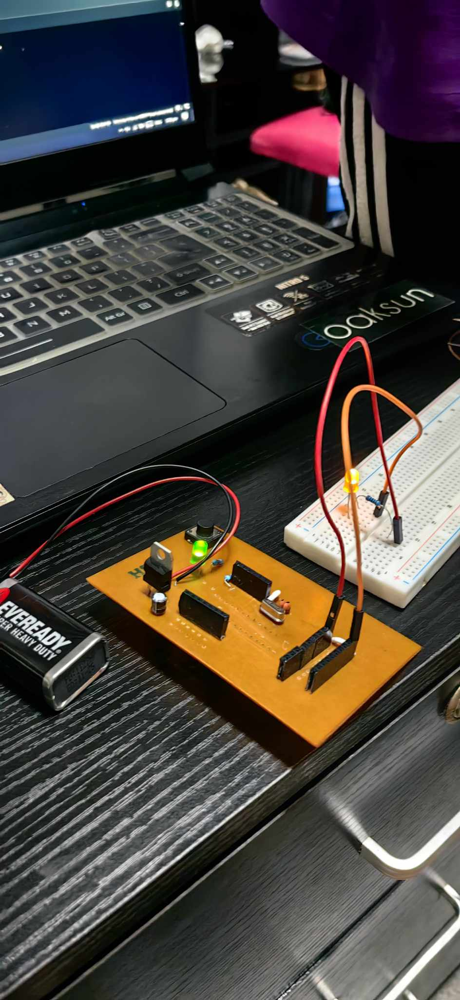

# ArduinoISP Firmware for Custom-Built Arduino Uno

This project contains a customized version of the **ArduinoISP** sketch, used as a firmware programmer to upload code and bootloaders to AVR microcontrollers via SPI.

---

## 🏫 National University Manila

🎓 **Capstone/Embedded Systems Activity**  
📌 **Project:** Building an Arduino Uno from scratch  
🧰 **Purpose:** Used this firmware to flash the bootloader onto my custom-built Arduino Uno

---

## 🧠 Features
- Converts a standard Arduino (e.g., Uno, Nano) into an AVR In-System Programmer (ISP)
- Supports programming ATmega microcontrollers (e.g., ATmega328P)
- Can burn bootloaders, upload sketches, or program EEPROM and fuses
- Provides status feedback using LEDs:
  - `LED_HB` – Heartbeat (alive status)
  - `LED_PMODE` – Programming mode active
  - `LED_ERR` – Error status
- Uses either hardware SPI or bit-banged SPI depending on pin configuration

---

## 🛠 How I Used It

As part of our project at **National University Manila**, I built my own **Arduino Uno** on a breadboard using an **ATmega328P** chip.

Since the chip was new and had no bootloader, I uploaded this sketch to another Arduino board and used it as a programmer to:

1. **Burn the bootloader**
2. **Upload the initial test sketches**
3. **Flash EEPROM content**

---

## 🧪 Connections

| Programmer Arduino | Target Custom Arduino Uno |
|--------------------|----------------------------|
| MOSI               | MOSI (Pin 17 on ATmega328P) |
| MISO               | MISO (Pin 18 on ATmega328P) |
| SCK                | SCK (Pin 19 on ATmega328P)  |
| RESET              | RESET (Pin 1 on ATmega328P) |
| GND                | GND                         |
| VCC (optional)     | VCC                         |

---

## ⚙ Baudrate

- Default: `19200`
- Can be adjusted if needed

---

## 📷 Custom Arduino

---

---
## 📄 License

Based on the official [ArduinoISP](https://github.com/arduino/ArduinoISP) sketch.  
Licensed under the GNU General Public License (GPL).

---

## 📌 Repo Contents

- `ArduinoISP.ino` – The full programmer sketch
- `README.md` – This documentation
- Useful references and code comments throughout

---

💡 **Feel free to fork or clone this if you're also building your own Arduino Uno or ATmega project from scratch!**
